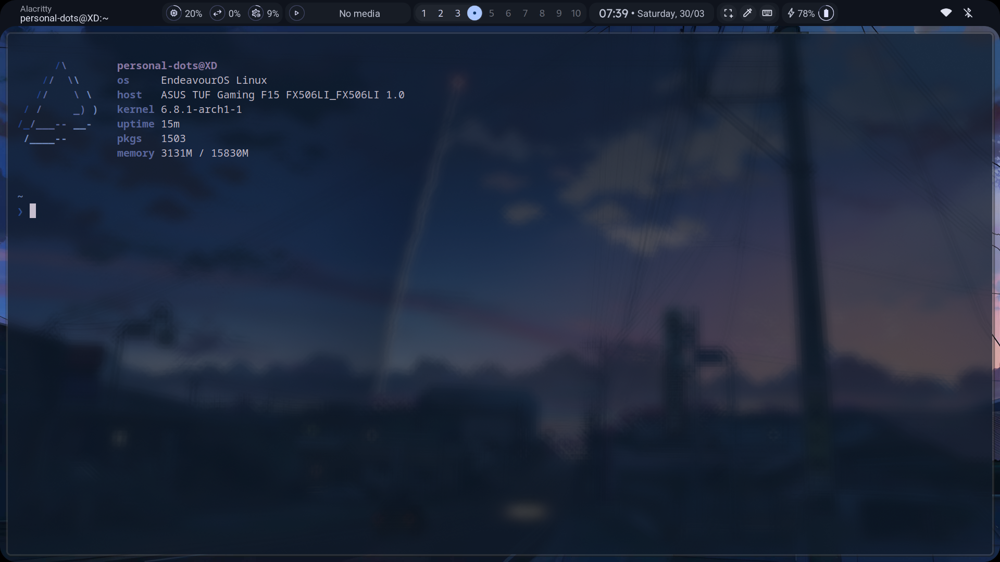
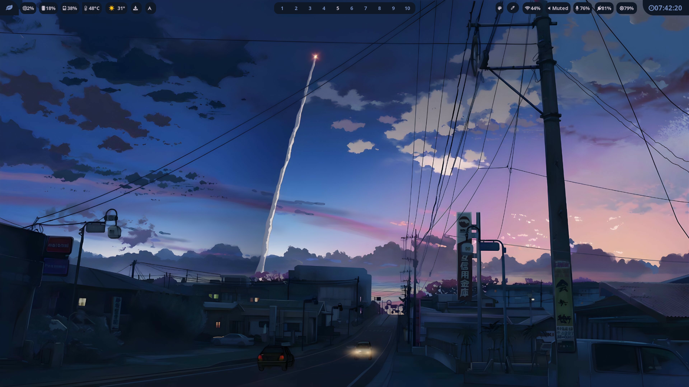
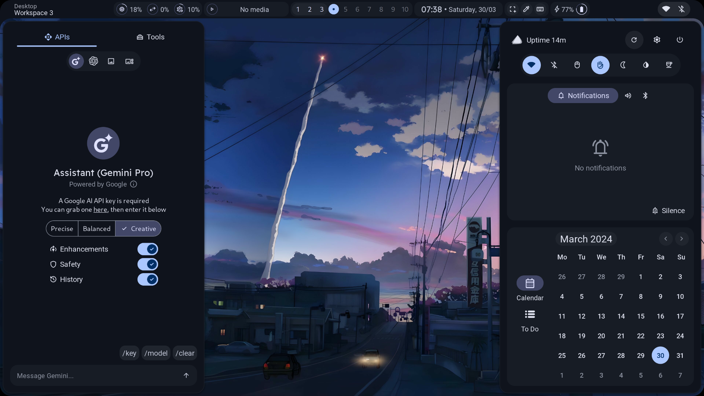

<br/>
<p align="center">
  <a href="https://github.com/harshborana11/dotfiles">
    
  </a>

  <h3 align="center">Dotfiles</h3>

  <p align="center">
    just  normal dot files
    <br/>
    <br/>
  </p>
</p>

# Dot files
  
Just some normal dotfiles for arch hyprland


## Screenshots





with end_4's ags


## Setup

Get these dot files working 

### installing dependencies ( for arch only )
you can search these in  your pakage manager 
```bash
 yay -S coreutils cliphist cmake curl fuzzel rsync wget ripgrep gojq npm meson typescript gjs dart-sass axel aylurs-gtk-shell webp-pixbuf-loader gtk-layer-shell gtk3 gtksourceview3 gobject-introspection upower yad ydotool polkit-gnome gnome-keyring gnome-control-center blueberry networkmanager brightnessctl wlsunset gnome-bluetooth-3.0 adw-gtk3-git qt5ct qt5-wayland gradience-git fontconfig ttf-readex-pro ttf-jetbrains-mono-nerd ttf-material-symbols-variable-git ttf-space-mono-nerd fish foot starship swappy wf-recorder grim tesseract tesseract-data-eng slurp pavucontrol wireplumber libdbusmenu-gtk3 plasma-browser-integration playerctl python-build python-materialyoucolor-git python-pillow python-pywal python-setuptools-scm python-wheel rofi-git pfetch-git neofech-git pywal-git waybar-git swww-git chezmoi-git catppuccin-gtk-theme-mocha
```
    
### settingup dotfiles 

```bash
    chezmoi init --apply --verbose git@github.com:harshborana11/dotfiles.git
```

### updating dotfiles 
```bash 
 chezmoi update
```
